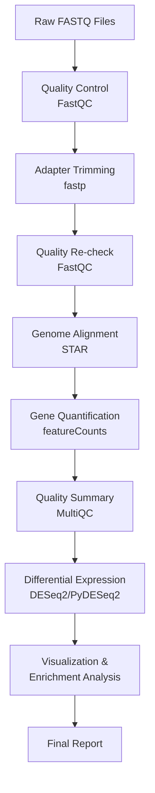
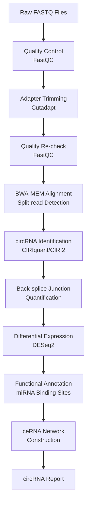
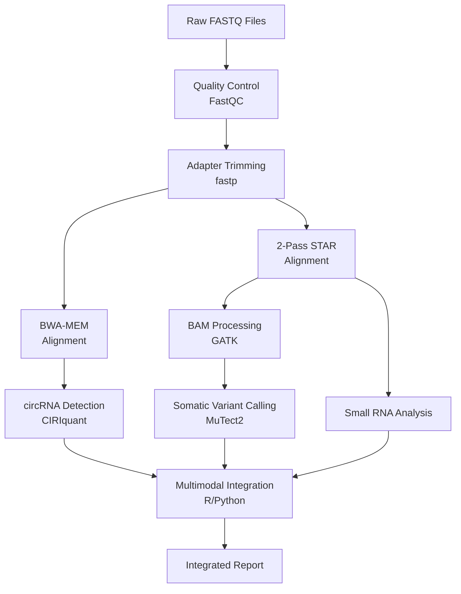
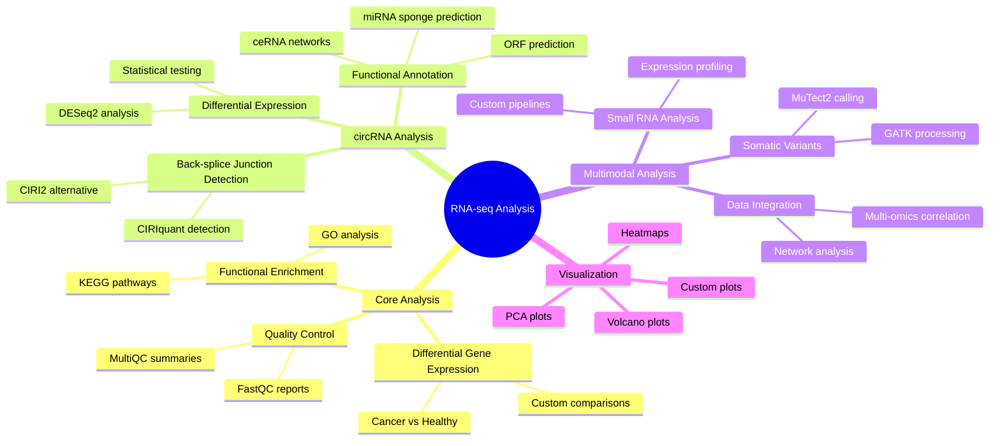
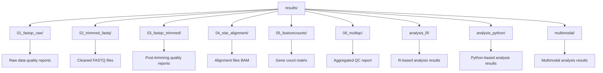
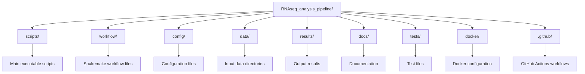

# RNA-Seq Differential Expression Analysis Pipeline

[](https://github.com/username/RNAseq_analysis_pipeline/actions)
[](https://hub.docker.com/r/username/rnaseq-pipeline)
[](https://opensource.org/licenses/MIT)
[](docs/)
[](https://doi.org/10.5281/zenodo.xxxxxx)

A comprehensive, production-ready pipeline for RNA-seq differential gene expression analysis with automated interpretation, visualization, and integrated circular RNA (circRNA) discovery.

## 🚀 Features

- **Complete End-to-End Analysis**: From raw FASTQ files to biological insights
- **Dual Implementation**: Both bash scripts and Snakemake workflows
- **Cross-Platform Analysis**: R and Python scripts for flexibility
- **Automated Interpretation**: Statistical analysis, visualization, and pathway enrichment
- **Multimodal Analysis**: Support for somatic variant calling, small RNA analysis, circRNA discovery, and integrated multi-omics
- **circRNA Analysis**: Comprehensive circular RNA identification, quantification, and functional annotation
- **Reproducible**: Conda environments and Docker containerization
- **Scalable**: Automatic parallelization and cloud-ready
- **Publication-Ready**: High-quality plots and comprehensive reports

## 📋 Table of Contents

- [Quick Start](#-quick-start)
- [Installation](#-installation)
- [Usage](#-usage)
- [Pipeline Overview](#-pipeline-overview)
- [Output Files](#-output-files)
- [Configuration](#-configuration)
- [Examples](#-examples)
- [Contributing](#-contributing)
- [Citation](#-citation)
- [License](#-license)

## 🏁 Quick Start

### Prerequisites
- Linux/macOS system
- Conda/Mamba package manager
- Docker (optional)
- 8+ GB RAM, 4+ CPU cores recommended

### Installation
```bash
# Clone the repository
git clone https://github.com/username/RNAseq_analysis_pipeline.git
cd RNAseq_analysis_pipeline

# Install dependencies
./scripts/setup_environment.sh

# Activate environment
conda activate rnaseq-pipeline
```

### Run Analysis
```bash
# Option 1: Quick bash pipeline
./scripts/run_rnaseq_pipeline.sh

# Option 2: Scalable Snakemake workflow
cd workflow
snakemake --use-conda --cores 8

# Option 3: circRNA analysis pipeline
./scripts/circrna_pipeline.sh

# Option 4: Integrated pipeline (RNA-seq + circRNA)
./scripts/run_integrated_pipeline.sh --mode all

# Option 5: Multimodal analysis pipeline
./scripts/run_star_2pass.sh  # For 2-pass STAR alignment
./scripts/multimodal_integration.R  # For integrated analysis

# Option 6: Docker container
docker-compose up
```

## 🔧 Installation

### Method 1: Conda Environment (Recommended)
```bash
# Create and activate environment
conda env create -f environment.yml
conda activate rnaseq-pipeline

# Verify installation
fastqc --version
snakemake --version
```

### Method 2: Docker Container
```bash
# Build container
docker build -t rnaseq-pipeline .

# Run with Docker Compose
docker-compose up
```

### Method 3: Manual Installation
See [detailed installation guide](docs/installation.md) for manual setup instructions.

## 📊 Usage

### Basic Workflow

1. **Prepare your data**:
   ```bash
   # Place FASTQ files in data/raw_fastq/
   # Format: {sample}_R1.fastq.gz, {sample}_R2.fastq.gz
   ```

2. **Configure samples**:
   ```bash
   # Edit config/samples.tsv
   # Edit config/metadata.tsv
   ```

3. **Run pipeline**:
   ```bash
   # Bash pipeline
   ./scripts/run_rnaseq_pipeline.sh

   # Or Snakemake workflow
   cd workflow && snakemake --use-conda --cores 8
   ```

4. **Analyze results**:
   ```bash
   # R analysis
   Rscript scripts/interpret_results.R results/05_featurecounts/raw_counts.tsv config/metadata.tsv results/analysis_R

   # Python analysis
   python scripts/interpret_results.py results/05_featurecounts/raw_counts.tsv config/metadata.tsv results/analysis_python
   ```

### Advanced Usage

#### Custom Configuration
```bash
# Modify parameters
vim config/config.yaml

# Custom sample sheet
vim config/samples.tsv
```

#### Cluster Execution
```bash
# SLURM cluster
snakemake --profile slurm --jobs 100

# SGE cluster
snakemake --cluster "qsub -pe smp {threads}" --jobs 50
```

#### Multimodal Analysis
```bash
# Somatic variant calling
./scripts/mutect2_somatic_calling.sh

# Small RNA analysis
./scripts/small_rna_analysis.sh

# Generate custom visualizations
python scripts/generate_visualizations.py

# Multimodal integration
Rscript scripts/multimodal_integration.R

# circRNA analysis
./scripts/circrna_pipeline.sh

# Integrated analysis (RNA-seq + circRNA)
./scripts/run_integrated_pipeline.sh --mode all
```

#### circRNA Analysis Workflow
```bash
# Option 1: Standalone circRNA analysis
./scripts/circrna_pipeline.sh data/raw_fastq "Sample1,Sample2,Sample3" "Cancer,Cancer,Healthy"

# Option 2: Using Snakemake
cd workflow
snakemake --use-conda --cores 8 -s Snakefile_circrna

# Option 3: Integrated with standard RNA-seq
./scripts/run_integrated_pipeline.sh --mode multimodal --samples "S1,S2,S3" --conditions "A,A,B"
```

## 🔄 Pipeline Overview

### Core Workflow



### circRNA Analysis Workflow



### Multimodal Workflow



### Supported Analysis Types



## 📁 Output Files

### Directory Structure



### Key Output Files
- `raw_counts.tsv`: Gene expression count matrix
- `multiqc_report.html`: Comprehensive QC summary
- `deseq2_results.csv`: Differential expression results
- `up_regulated_genes.csv`: Significantly upregulated genes
- `down_regulated_genes.csv`: Significantly downregulated genes
- `pca_plot.png`: Principal component analysis
- `volcano_plot.png`: Volcano plot of differential expression
- `heatmap_top50_degs.png`: Heatmap of top differentially expressed genes

## ⚙️ Configuration

### Sample Configuration (`config/samples.tsv`)
```tsv
sample	condition
Cancer_1	Cancer
Cancer_2	Cancer
Cancer_3	Cancer
Healthy_1	Healthy
Healthy_2	Healthy
Healthy_3	Healthy
```

### Pipeline Parameters (`config/config.yaml`)
```yaml
reference:
  genome_fasta: "data/reference/GRCh38.primary_assembly.genome.fa"
  annotation_gtf: "data/reference/gencode.v38.primary_assembly.annotation.gtf"

params:
  fastp:
    min_len: 25
  star:
    sjdbOverhang: 99
  featureCounts:
    strand: 2
```

## 🧬 Bioinformatics Tools

### Core Tools
- **Quality Control**: FastQC 0.11.9, fastp 0.23.2, MultiQC 1.14
- **Alignment**: STAR 2.7.10, Samtools 1.15
- **Quantification**: featureCounts (Subread 2.0.3), Salmon 1.9.0
- **Analysis**: DESeq2 1.36.0, PyDESeq2 0.3.2
- **Functional Analysis**: clusterProfiler 4.4.4, GSEApy 1.0.4
- **Workflow**: Snakemake 7.18.2

### Multimodal Tools
- **Variant Calling**: GATK 4.4.0, MuTect2
- **Small RNA Analysis**: Custom Python/R scripts
- **Integration**: Custom R/Python pipelines

### Reference Data
- **Human Genome**: GRCh38/hg38 (GENCODE v38)
- **Gene Annotation**: GENCODE comprehensive gene annotation
- **Pathway Databases**: GO, KEGG, Reactome

## 📈 Examples

### Example Dataset
A small test dataset is provided in `data/test_data/` for pipeline validation:
- 6 samples (3 cancer, 3 healthy)
- Subsampled reads for quick testing
- Expected runtime: ~30 minutes

### Running Examples
```bash
# Test with example data
cd examples
./run_example_analysis.sh

# Validate results
python validate_results.py
```

## 🏗️ Development

### Project Structure



### Testing
```bash
# Run unit tests
pytest tests/

# Run integration tests
./tests/run_integration_tests.sh

# Validate pipeline
snakemake --lint
```

## 🤝 Contributing

We welcome contributions! Please see our [Contributing Guidelines](CONTRIBUTING.md) for details.

### How to Contribute
1. Fork the repository
2. Create a feature branch
3. Make your changes
4. Add tests
5. Submit a pull request

### Code of Conduct
This project adheres to a [Code of Conduct](CODE_OF_CONDUCT.md). By participating, you are expected to uphold this code.

## 📚 Documentation

- [Installation Guide](docs/installation.md)
- [Usage Tutorial](docs/usage.md)
- [Configuration Reference](docs/configuration.md)
- [Troubleshooting](docs/troubleshooting.md)
- [API Documentation](docs/api.md)

## 🎯 Citation

If you use this pipeline in your research, please cite:

```bibtex
@software{rnaseq_pipeline_2024,
  title = {RNA-Seq Differential Expression Analysis Pipeline},
  author = {Your Name},
  year = {2024},
  url = {https://github.com/username/RNAseq_analysis_pipeline},
  doi = {10.5281/zenodo.xxxxxx}
}
```

## 📞 Support

- **Issues**: [GitHub Issues](https://github.com/username/RNAseq_analysis_pipeline/issues)
- **Discussions**: [GitHub Discussions](https://github.com/username/RNAseq_analysis_pipeline/discussions)
- **Email**: support@yourlab.edu

## 🏆 Acknowledgments

- **DESeq2**: Love, Huber, and Anders (2014)
- **STAR**: Dobin et al. (2013)
- **Snakemake**: Köster and Rahmann (2012)
- **GENCODE**: Frankish et al. (2019)

## 📄 License

This project is licensed under the MIT License - see the [LICENSE](LICENSE) file for details.

---

**Maintained by**: [Your Name](https://github.com/username)
**Last Updated**: September 2024
**Version**: 1.0.0