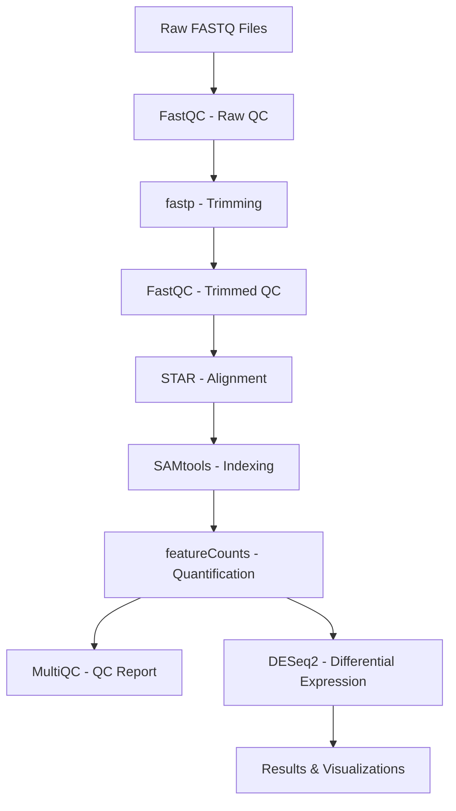

# RNA-seq Analysis Pipeline - Nextflow Implementation

[](https://www.nextflow.io/)
[](https://docs.conda.io/en/latest/)
[](https://www.docker.com/)
[](https://sylabs.io/docs/)

A comprehensive, production-ready Nextflow pipeline for RNA-seq differential expression analysis with support for circular RNA (circRNA) discovery and multimodal cancer genomics analysis.

---

## 📋 Table of Contents

- [Overview](#overview)
- [Features](#features)
- [Quick Start](#quick-start)
- [Installation](#installation)
- [Usage](#usage)
- [Pipeline Workflows](#pipeline-workflows)
- [Input Specifications](#input-specifications)
- [Output Files](#output-files)
- [Parameters](#parameters)
- [Configuration](#configuration)
- [Execution Profiles](#execution-profiles)
- [Advanced Usage](#advanced-usage)
- [Troubleshooting](#troubleshooting)
- [FAQ](#faq)
- [Performance & Optimization](#performance--optimization)
- [Comparison with Snakemake](#comparison-with-snakemake)
- [Development & Contributing](#development--contributing)
- [Citation](#citation)
- [License](#license)
- [Support](#support)

---

## Overview

This Nextflow pipeline implements a complete RNA-seq analysis workflow from raw FASTQ files to publication-ready differential expression results. It is a modern reimplementation of the original Snakemake pipeline with enhanced features including:

- **Channel-based parallel processing** for improved performance
- **Native cloud support** (AWS, Google Cloud, Azure)
- **Modular architecture** following nf-core best practices
- **Multiple execution modes** (conda, docker, singularity)
- **Comprehensive quality control** and reporting
- **Automated differential expression analysis** with visualizations

### 🎯 Current Status

**✅ Production Ready**: Standard RNA-seq workflow (FASTQ → DESeq2)
**🚧 In Development**: circRNA and multimodal workflows

### 📊 Workflow Overview



---

## Features

### ✨ Core Features

- **🔬 Complete RNA-seq Analysis**: From raw reads to differential expression
- **📊 Publication-Ready Outputs**: High-quality plots (PCA, volcano, heatmap, MA)
- **⚡ Parallel Processing**: Efficient sample-level parallelization
- **🔄 Automatic Resume**: Continue from checkpoint after interruption
- **☁️ Cloud Native**: Run on AWS, Google Cloud, Azure, or local HPC
- **🐳 Container Support**: Docker, Singularity, or Conda environments
- **📈 Comprehensive QC**: MultiQC aggregated reports
- **🎛️ Flexible Configuration**: Extensive parameter customization
- **🔍 Input Validation**: Automatic samplesheet and parameter validation
- **📝 Detailed Logging**: Execution timeline, resource usage, and DAG visualization

### 🧬 Bioinformatics Tools

| Tool | Version | Purpose |
|------|---------|---------|
| FastQC | 0.11.9 | Quality control |
| fastp | 0.23.2 | Adapter trimming |
| STAR | 2.7.10a | Read alignment |
| SAMtools | 1.17 | BAM processing |
| featureCounts | 2.0.3 | Gene quantification |
| MultiQC | 1.14 | QC aggregation |
| DESeq2 | 1.38.0 | Differential expression |
| R | 4.2.0 | Statistical analysis |
| Python | 3.9 | Data processing |

### 🚀 Workflow Modes

1. **Standard RNA-seq** ✅ (READY)
   - Differential gene expression analysis
   - GO and KEGG pathway enrichment
   - Comprehensive visualizations

2. **circRNA Analysis** 🚧 (IN DEVELOPMENT)
   - Circular RNA discovery with CIRIquant
   - Back-splice junction quantification
   - miRNA binding site prediction

3. **Multimodal Analysis** 🚧 (IN DEVELOPMENT)
   - Somatic variant calling (GATK/Mutect2)
   - Small RNA analysis
   - Multi-omics integration

---

## Quick Start

### Prerequisites

- **Nextflow** ≥23.04.0
- **Java** ≥11
- **Conda** or **Docker** or **Singularity**

### Installation

```bash
# Install Nextflow
curl -s https://get.nextflow.io | bash
sudo mv nextflow /usr/local/bin/  # Optional: add to PATH

# Clone repository
git clone https://github.com/username/RNAseq_analysis_pipeline.git
cd RNAseq_analysis_pipeline/nextflow
```

### Test Run

```bash
# Show help
nextflow run main.nf --help

# Test with example data (once test profile is configured)
nextflow run main.nf -profile test,conda
```

### Basic Execution

```bash
nextflow run main.nf \
    --input samplesheet.csv \
    --mode rnaseq \
    --outdir results \
    --genome_fasta /path/to/genome.fa \
    --annotation_gtf /path/to/genes.gtf \
    --metadata metadata.tsv \
    -profile conda
```

---

## Installation

### 1. Install Nextflow

**Option A: Direct Download**
```bash
curl -s https://get.nextflow.io | bash
chmod +x nextflow
sudo mv nextflow /usr/local/bin/
```

**Option B: Using Conda**
```bash
conda install -c bioconda nextflow
```

**Verify Installation**
```bash
nextflow -version
# Should be ≥23.04.0
```

### 2. Install Dependencies

Choose one of the following:

#### Using Conda (Recommended for Development)
```bash
# Conda will automatically create environments
# No additional setup required
```

#### Using Docker
```bash
# Install Docker (Ubuntu/Debian)
sudo apt-get update
sudo apt-get install docker.io
sudo usermod -aG docker $USER
# Log out and back in
```

#### Using Singularity (For HPC)
```bash
# Usually pre-installed on HPC clusters
# Or install from: https://docs.sylabs.io/guides/latest/user-guide/
```

### 3. Clone Pipeline

```bash
git clone https://github.com/username/RNAseq_analysis_pipeline.git
cd RNAseq_analysis_pipeline/nextflow
```

---

## Usage

### Basic Command Structure

```bash
nextflow run main.nf \
    --input <SAMPLESHEET> \
    --mode <MODE> \
    --outdir <OUTPUT_DIR> \
    --genome_fasta <GENOME> \
    --annotation_gtf <GTF> \
    [OPTIONS] \
    -profile <PROFILE>
```

### Essential Parameters

| Parameter | Description | Required |
|-----------|-------------|----------|
| `--input` | Path to CSV samplesheet | ✅ Yes |
| `--mode` | Analysis mode (`rnaseq`, `circrna`, `multimodal`) | ✅ Yes |
| `--outdir` | Output directory | No (default: `results`) |
| `--genome_fasta` | Reference genome FASTA | ✅ Yes |
| `--annotation_gtf` | Gene annotation GTF | ✅ Yes |
| `--metadata` | Metadata file for DE analysis | Conditional* |

*Required if running DESeq2 analysis

### Complete Example

```bash
nextflow run main.nf \
    --input samples.csv \
    --mode rnaseq \
    --outdir results_rnaseq \
    --genome_fasta data/reference/GRCh38.primary_assembly.genome.fa \
    --annotation_gtf data/reference/gencode.v38.primary_assembly.annotation.gtf \
    --metadata metadata.tsv \
    --strand_specificity 2 \
    --padj_threshold 0.05 \
    --log2fc_threshold 1.0 \
    --control_condition Healthy \
    --treatment_condition Cancer \
    --max_cpus 16 \
    --max_memory 64.GB \
    -profile conda \
    -resume
```

---

## Pipeline Workflows

### 1. Standard RNA-seq Workflow ✅

**Status**: Production Ready

#### Workflow Steps

1. **Quality Control (FastQC)**
   - Assess raw read quality
   - Identify potential issues

2. **Adapter Trimming (fastp)**
   - Remove adapters
   - Quality filtering
   - Length filtering

3. **Post-trim QC (FastQC)**
   - Verify trimming effectiveness

4. **Genome Alignment (STAR)**
   - Map reads to reference genome
   - Generate sorted BAM files

5. **BAM Indexing (SAMtools)**
   - Create BAI indices

6. **Gene Quantification (featureCounts)**
   - Count reads per gene
   - Generate count matrix

7. **QC Aggregation (MultiQC)**
   - Aggregate all QC metrics
   - Generate comprehensive HTML report

8. **Differential Expression (DESeq2)**
   - Normalize counts
   - Statistical testing
   - Generate visualizations:
     - PCA plot
     - Volcano plot
     - Heatmap (top 50 DEGs)
     - MA plot

#### Example Usage

```bash
nextflow run main.nf \
    --input samples.csv \
    --mode rnaseq \
    --genome_fasta genome.fa \
    --annotation_gtf genes.gtf \
    --metadata metadata.tsv \
    -profile conda
```

#### Expected Runtime

| Samples | Reads/Sample | Threads | Runtime (est.) |
|---------|--------------|---------|----------------|
| 6 | 30M | 8 | ~4-6 hours |
| 12 | 30M | 16 | ~5-8 hours |
| 24 | 30M | 32 | ~6-10 hours |

### 2. circRNA Workflow 🚧

**Status**: In Development (See `nextflow.plan` Phase 3)

**Planned Features**:
- BWA-MEM alignment for split-read detection
- CIRIquant/CIRI2 circRNA identification
- Back-splice junction quantification
- Differential expression of circRNAs
- miRNA binding site prediction (miRanda)
- ceRNA network construction

### 3. Multimodal Workflow 🚧

**Status**: In Development (See `nextflow.plan` Phase 4)

**Planned Features**:
- 2-pass STAR alignment
- GATK BAM processing
- Mutect2 somatic variant calling
- Small RNA analysis
- Multi-omics data integration

---

## Input Specifications

### Samplesheet Format

Create a **comma-separated CSV file** with the following columns:

```csv
sample,fastq_1,fastq_2,condition
```

#### Required Columns

| Column | Description | Example |
|--------|-------------|---------|
| `sample` | Unique sample identifier | `Cancer_1` |
| `fastq_1` | Path to R1 FASTQ file | `/path/to/sample_R1.fastq.gz` |
| `fastq_2` | Path to R2 FASTQ file (PE) | `/path/to/sample_R2.fastq.gz` |
| `condition` | Experimental condition | `Cancer` or `Healthy` |

#### Example Samplesheet

```csv
sample,fastq_1,fastq_2,condition
Cancer_1,data/raw_fastq/Cancer_1_R1.fastq.gz,data/raw_fastq/Cancer_1_R2.fastq.gz,Cancer
Cancer_2,data/raw_fastq/Cancer_2_R1.fastq.gz,data/raw_fastq/Cancer_2_R2.fastq.gz,Cancer
Cancer_3,data/raw_fastq/Cancer_3_R1.fastq.gz,data/raw_fastq/Cancer_3_R2.fastq.gz,Cancer
Healthy_1,data/raw_fastq/Healthy_1_R1.fastq.gz,data/raw_fastq/Healthy_1_R2.fastq.gz,Healthy
Healthy_2,data/raw_fastq/Healthy_2_R1.fastq.gz,data/raw_fastq/Healthy_2_R2.fastq.gz,Healthy
Healthy_3,data/raw_fastq/Healthy_3_R1.fastq.gz,data/raw_fastq/Healthy_3_R2.fastq.gz,Healthy
```

See `assets/samplesheet_example.csv` for reference.

#### Single-End Data

For single-end sequencing, leave `fastq_2` empty or omit the column:

```csv
sample,fastq_1,condition
Sample_1,/path/to/sample_1.fastq.gz,Treatment
Sample_2,/path/to/sample_2.fastq.gz,Control
```

### Metadata File Format

For differential expression analysis, create a **tab-separated TSV file**:

```tsv
sample	condition
Cancer_1	Cancer
Cancer_2	Cancer
Cancer_3	Cancer
Healthy_1	Healthy
Healthy_2	Healthy
Healthy_3	Healthy
```

#### Requirements

- First column: `sample` (must match samplesheet)
- Second column: `condition` (experimental group)
- Tab-separated (not comma)
- No quotes around values

### Reference Files

#### Required References

1. **Genome FASTA** (`.fa` or `.fasta`)
   - Example: `GRCh38.primary_assembly.genome.fa`
   - Source: GENCODE, Ensembl, or UCSC

2. **Gene Annotation GTF** (`.gtf`)
   - Example: `gencode.v38.primary_assembly.annotation.gtf`
   - Must match genome assembly
   - Source: GENCODE or Ensembl

#### Optional References

3. **STAR Index** (pre-built)
   - Use `--star_index` to provide pre-built index
   - Otherwise, index will be generated automatically

4. **dbSNP VCF** (for variant calling)
   - Required for multimodal workflow

### File Naming Conventions

- Use consistent naming: `{sample}_{R1/R2}.fastq.gz`
- Avoid spaces in file/sample names
- Use absolute or relative paths from run directory
- Ensure FASTQ files are gzip-compressed (`.gz`)

---

## Output Files

### Directory Structure

```
results/
├── fastqc/
│   ├── {sample}_R1_fastqc.html
│   ├── {sample}_R1_fastqc.zip
│   ├── {sample}_R2_fastqc.html
│   └── {sample}_R2_fastqc.zip
├── fastp/
│   ├── {sample}.fastp.html
│   ├── {sample}.fastp.json
│   └── log/
│       └── {sample}.log
├── star/
│   ├── {sample}_Aligned.sortedByCoord.out.bam
│   ├── {sample}_Aligned.sortedByCoord.out.bam.bai
│   └── log/
│       └── {sample}_Log.final.out
├── featurecounts/
│   ├── all_samples.featureCounts.txt
│   └── all_samples.featureCounts.txt.summary
├── multiqc/
│   ├── multiqc_report.html
│   └── multiqc_data/
├── deseq2/
│   ├── deseq2_results.csv
│   ├── deseq2_results_significant.csv
│   ├── up_regulated_genes.csv
│   ├── down_regulated_genes.csv
│   ├── pca_plot.png
│   ├── volcano_plot.png
│   ├── heatmap_top50.png
│   └── ma_plot.png
└── pipeline_info/
    ├── execution_timeline_{timestamp}.html
    ├── execution_report_{timestamp}.html
    ├── execution_trace_{timestamp}.txt
    └── pipeline_dag_{timestamp}.html
```

### Key Output Files

#### Quality Control

| File | Description |
|------|-------------|
| `*_fastqc.html` | Per-sample quality reports |
| `*.fastp.html` | Trimming statistics |
| `multiqc_report.html` | Aggregated QC across all samples |

#### Alignment

| File | Description |
|------|-------------|
| `*.bam` | Aligned reads (coordinate sorted) |
| `*.bam.bai` | BAM index files |
| `*Log.final.out` | STAR alignment statistics |

#### Quantification

| File | Description |
|------|-------------|
| `*.featureCounts.txt` | Gene count matrix |
| `*.featureCounts.txt.summary` | Counting statistics |

#### Differential Expression

| File | Description |
|------|-------------|
| `deseq2_results.csv` | All genes with statistics |
| `deseq2_results_significant.csv` | Filtered significant genes |
| `up_regulated_genes.csv` | Upregulated genes only |
| `down_regulated_genes.csv` | Downregulated genes only |
| `pca_plot.png` | Principal component analysis |
| `volcano_plot.png` | Volcano plot of DEGs |
| `heatmap_top50.png` | Heatmap of top 50 DEGs |
| `ma_plot.png` | MA plot (mean vs fold-change) |

#### Pipeline Execution

| File | Description |
|------|-------------|
| `execution_timeline_*.html` | Visual timeline of process execution |
| `execution_report_*.html` | Summary of resource usage |
| `execution_trace_*.txt` | Detailed execution trace |
| `pipeline_dag_*.html` | Workflow directed acyclic graph |

### Output File Formats

#### DESeq2 Results CSV

```csv
gene,baseMean,log2FoldChange,lfcSE,stat,pvalue,padj
ENSG00000000003,1250.5,2.34,0.15,15.6,1.2e-55,3.4e-52
ENSG00000000005,450.2,-1.89,0.22,-8.6,8.9e-18,4.5e-15
...
```

#### featureCounts Output

```
Geneid	Chr	Start	End	Strand	Length	Sample1.bam	Sample2.bam	...
ENSG00000000003	X	100627109	100639991	-	4535	1250	1180	...
ENSG00000000005	X	100584802	100599885	+	1610	450	420	...
...
```

---

## Parameters

### Input/Output Parameters

```bash
--input                   # Path to input samplesheet CSV (required)
--outdir                  # Output directory (default: 'results')
--mode                    # Analysis mode: 'rnaseq', 'circrna', 'multimodal' (default: 'rnaseq')
```

### Reference Genome Parameters

```bash
--genome_fasta            # Path to genome FASTA file (required)
--annotation_gtf          # Path to gene annotation GTF file (required)
--star_index              # Path to pre-built STAR index (optional)
--genome                  # Genome name, e.g., 'GRCh38' (default: 'GRCh38')
```

### Read Parameters

```bash
--read_length             # Read length for STAR indexing (default: 100)
--single_end              # Treat all samples as single-end (default: false)
```

### Trimming Parameters

```bash
--min_trimmed_length      # Minimum read length after trimming (default: 25)
--quality_cutoff          # Quality threshold for trimming (default: 20)
--adapter_fwd             # Forward adapter sequence (default: auto-detect)
--adapter_rev             # Reverse adapter sequence (default: auto-detect)
```

### Alignment Parameters

```bash
--aligner                 # Aligner to use: 'star' or 'bwa' (default: 'star')
--sjdb_overhang           # STAR sjdbOverhang (default: read_length - 1)
--star_two_pass           # Enable STAR 2-pass mode (default: false)
```

### Quantification Parameters

```bash
--quantifier              # Quantification tool: 'featurecounts' or 'salmon' (default: 'featurecounts')
--strand_specificity      # Strandness: 0=unstranded, 1=forward, 2=reverse (default: 2)
--feature_type            # Feature type for counting (default: 'exon')
--gene_attribute          # Attribute for gene ID (default: 'gene_id')
```

### Differential Expression Parameters

```bash
--metadata                # Path to metadata TSV file (default: 'config/metadata.tsv')
--control_condition       # Name of control condition (default: 'Healthy')
--treatment_condition     # Name of treatment condition (default: 'Cancer')
--analysis_tool           # DE tool: 'deseq2' or 'pydeseq2' (default: 'deseq2')
--padj_threshold          # Adjusted p-value cutoff (default: 0.05)
--log2fc_threshold        # Log2 fold-change threshold (default: 1.0)
--min_base_mean           # Minimum base mean expression (default: 10)
```

### Functional Enrichment Parameters

```bash
--run_enrichment          # Run pathway enrichment analysis (default: true)
--go_analysis             # Run GO analysis (default: true)
--kegg_analysis           # Run KEGG pathway analysis (default: true)
--organism                # Organism code for KEGG (default: 'hsa')
```

### Skip Options

```bash
--skip_fastqc             # Skip FastQC steps
--skip_trimming           # Skip adapter trimming
--skip_multiqc            # Skip MultiQC report generation
--skip_deseq2             # Skip DESeq2 analysis
```

### Resource Parameters

```bash
--max_cpus                # Maximum CPUs to use (default: 16)
--max_memory              # Maximum memory (default: '128.GB')
--max_time                # Maximum time per job (default: '240.h')
```

### MultiQC Parameters

```bash
--multiqc_config          # Path to custom MultiQC config
--multiqc_title           # Title for MultiQC report (default: 'RNA-Seq Analysis Report')
```

### Other Parameters

```bash
--help                    # Show help message
--publish_dir_mode        # How to publish files: 'symlink', 'copy', 'move' (default: 'copy')
--email                   # Email address for completion notification
```

---

## Configuration

### Configuration Files

The pipeline uses multiple configuration files:

1. **`nextflow.config`** - Main configuration
2. **`conf/base.config`** - Process resource defaults
3. **`conf/modules.config`** - Module-specific settings
4. **`conf/test.config`** - Test profile configuration

### Resource Labels

Processes are assigned resource labels for dynamic allocation:

| Label | CPUs | Memory | Time |
|-------|------|--------|------|
| `process_single` | 1 | 6 GB | 4 h |
| `process_low` | 2 | 12 GB | 4 h |
| `process_medium` | 6 | 36 GB | 8 h |
| `process_high` | 12 | 72 GB | 16 h |
| `process_long` | 2 | 12 GB | 20 h |
| `process_high_memory` | 2 | 200 GB | 16 h |

### Custom Configuration

Create a custom configuration file:

```groovy
// custom.config
params {
    max_cpus = 32
    max_memory = '256.GB'
}

process {
    withName: STAR_ALIGN {
        cpus = 16
        memory = 64.GB
    }
}
```

Use with:
```bash
nextflow run main.nf -c custom.config -profile conda
```

---

## Execution Profiles

### Available Profiles

| Profile | Description | Use Case |
|---------|-------------|----------|
| `conda` | Use Conda for dependencies | Development, local execution |
| `mamba` | Use Mamba (faster Conda) | Development, local execution |
| `docker` | Use Docker containers | Production, cloud |
| `singularity` | Use Singularity containers | HPC clusters |
| `test` | Run with test data | Testing, validation |

### Profile Usage

#### Conda Profile

```bash
nextflow run main.nf -profile conda --input samples.csv --mode rnaseq
```

**Pros**: Easy setup, no root required
**Cons**: Slower environment creation

#### Mamba Profile

```bash
nextflow run main.nf -profile mamba --input samples.csv --mode rnaseq
```

**Pros**: Faster than Conda
**Cons**: Requires Mamba installation

#### Docker Profile

```bash
nextflow run main.nf -profile docker --input samples.csv --mode rnaseq
```

**Pros**: Consistent, reproducible
**Cons**: Requires Docker, root access (typically)

#### Singularity Profile

```bash
nextflow run main.nf -profile singularity --input samples.csv --mode rnaseq
```

**Pros**: HPC-friendly, no root required
**Cons**: Requires Singularity installation

#### Test Profile

```bash
nextflow run main.nf -profile test,conda
```

Uses minimal test dataset for quick validation.

### Combining Profiles

```bash
# Use test data with Docker
nextflow run main.nf -profile test,docker

# Use Conda with debugging
nextflow run main.nf -profile conda,debug --input samples.csv
```

---

## Advanced Usage

### Resume Capability

Continue from last successful checkpoint:

```bash
nextflow run main.nf \
    --input samples.csv \
    --mode rnaseq \
    -profile conda \
    -resume
```

**Tip**: Always use `-resume` for iterative development!

### Running on HPC

#### SLURM Example

```bash
nextflow run main.nf \
    --input samples.csv \
    --mode rnaseq \
    -profile singularity \
    -qs slurm \
    -w /scratch/$USER/work
```

#### SGE Example

```bash
nextflow run main.nf \
    --input samples.csv \
    --mode rnaseq \
    -profile singularity \
    -qs sge
```

### Running on Cloud

#### AWS Batch

```bash
nextflow run main.nf \
    --input s3://bucket/samples.csv \
    --outdir s3://bucket/results \
    --mode rnaseq \
    -profile awsbatch \
    -work-dir s3://bucket/work
```

#### Google Cloud

```bash
nextflow run main.nf \
    --input gs://bucket/samples.csv \
    --outdir gs://bucket/results \
    --mode rnaseq \
    -profile google
```

### Resource Management

#### Limit Resources

```bash
nextflow run main.nf \
    --input samples.csv \
    --mode rnaseq \
    --max_cpus 8 \
    --max_memory 32.GB \
    --max_time 12.h \
    -profile conda
```

#### Custom Process Resources

```bash
# In custom config file
process {
    withName: 'STAR_ALIGN' {
        cpus = 16
        memory = 64.GB
        time = 8.h
    }
}
```

### Monitoring & Reporting

#### Tower Integration

```bash
# Set up Nextflow Tower (now Seqera Platform)
export TOWER_ACCESS_TOKEN=<your_token>

nextflow run main.nf \
    --input samples.csv \
    -with-tower \
    -profile conda
```

#### Generate Reports

```bash
nextflow run main.nf \
    --input samples.csv \
    -with-report report.html \
    -with-timeline timeline.html \
    -with-dag dag.html \
    -profile conda
```

### Debugging

#### Enable Debug Mode

```bash
nextflow run main.nf \
    --input samples.csv \
    -profile debug,conda
```

#### Verbose Logging

```bash
nextflow -log trace.log run main.nf --input samples.csv -profile conda
```

#### Keep Work Directory

```bash
# Work directory is kept by default
# Inspect specific process work directory
ls -la work/a1/b2c3d4e5f6...
```

---

## Troubleshooting

### Common Issues

#### 1. "Command not found: nextflow"

**Problem**: Nextflow not in PATH

**Solution**:
```bash
# Add to PATH
export PATH=$PATH:/path/to/nextflow

# Or install to /usr/local/bin
sudo mv nextflow /usr/local/bin/
```

#### 2. "No such file or directory"

**Problem**: File paths in samplesheet are incorrect

**Solution**:
- Use absolute paths: `/full/path/to/file.fastq.gz`
- Or relative paths from run directory
- Verify files exist: `ls -l /path/to/file.fastq.gz`

#### 3. Out of Memory Errors

**Problem**: Process exceeds available memory

**Solution**:
```bash
# Increase max memory
nextflow run main.nf --max_memory 128.GB -profile conda

# Or adjust specific process in config
process {
    withName: STAR_ALIGN {
        memory = 64.GB
    }
}
```

#### 4. Conda Environment Fails

**Problem**: Conda can't create environment

**Solution**:
```bash
# Use Mamba (faster, more reliable)
nextflow run main.nf -profile mamba

# Or clear Conda cache
conda clean --all

# Or specify conda prefix
NXF_CONDA_CACHEDIR=/scratch/conda nextflow run main.nf -profile conda
```

#### 5. Docker Permission Denied

**Problem**: Docker requires sudo

**Solution**:
```bash
# Add user to docker group
sudo usermod -aG docker $USER
# Log out and back in

# Or use Singularity instead
nextflow run main.nf -profile singularity
```

#### 6. STAR Index Generation Fails

**Problem**: Insufficient memory for indexing

**Solution**:
```bash
# Pre-build index separately with more resources
STAR --runMode genomeGenerate \
    --genomeDir star_index \
    --genomeFastaFiles genome.fa \
    --sjdbGTFfile genes.gtf \
    --runThreadN 16 \
    --limitGenomeGenerateRAM 64000000000

# Then provide to pipeline
nextflow run main.nf --star_index star_index -profile conda
```

#### 7. DESeq2 Analysis Fails

**Problem**: Metadata doesn't match samplesheet

**Solution**:
- Ensure sample IDs match exactly
- Use tab-separated TSV (not CSV)
- Check for hidden characters: `cat -A metadata.tsv`

#### 8. Pipeline Stalls

**Problem**: Process waiting for resources

**Solution**:
```bash
# Check what's running
nextflow log <run_name> -f status,name,duration

# Reduce parallelism
nextflow run main.nf -qs local --max_cpus 4 -profile conda
```

### Getting Help

#### View Logs

```bash
# List recent runs
nextflow log

# View specific run log
nextflow log <run_name>

# View process logs
cat work/a1/b2c3d4.../.command.log
```

#### Debug Mode

```bash
nextflow run main.nf -profile debug,conda --input samples.csv
```

#### Clean Work Directory

```bash
# Remove failed run intermediate files
nextflow clean -f -before <run_name>

# Remove all but last run
nextflow clean -f -k

# Complete cleanup
rm -rf work/
```

---

## FAQ

### General Questions

**Q: How is this different from the Snakemake version?**
A: Nextflow offers better parallelization, native cloud support, and efficient caching. Scientific results are identical.

**Q: Can I use pre-built STAR indices?**
A: Yes! Use `--star_index /path/to/index` to skip index generation.

**Q: What genome assemblies are supported?**
A: Any genome with FASTA and GTF files. Tested with GRCh38 (human) and GRCm39 (mouse).

**Q: Can I run without DESeq2 analysis?**
A: Yes, use `--skip_deseq2`.

**Q: How do I cite this pipeline?**
A: See [Citation](#citation) section.

### Technical Questions

**Q: What read lengths are supported?**
A: Any length. Adjust `--read_length` for STAR indexing (default: 100).

**Q: Can I use single-end data?**
A: Yes, leave `fastq_2` column empty in samplesheet.

**Q: What strandedness settings should I use?**
A: Depends on library prep:
- `0`: Unstranded (old protocols)
- `1`: Stranded forward (dUTP, NSR, NNSR)
- `2`: Stranded reverse (Illumina TruSeq, most common)

**Q: Can I skip adapter trimming?**
A: Yes, use `--skip_trimming`, but not recommended.

**Q: How much disk space do I need?**
A: Approximately 10-15x the size of input FASTQ files.

**Q: Can I analyze more than 2 conditions?**
A: Current DESeq2 module supports 2 conditions. For complex designs, use the count matrix with custom R scripts.

**Q: Where are temporary files stored?**
A: In `work/` directory. Use `-w` to specify location.

### Performance Questions

**Q: How many samples can I process?**
A: Tested with up to 100+ samples. Limited only by available resources.

**Q: How can I speed up the pipeline?**
A:
- Use pre-built STAR index
- Increase `--max_cpus`
- Use Mamba instead of Conda
- Run on HPC or cloud
- Use SSD storage

**Q: Can I run multiple pipelines simultaneously?**
A: Yes, but ensure different work directories.

**Q: What's the memory requirement per sample?**
A:
- FastQC: ~2 GB
- fastp: ~4 GB
- STAR: ~32-40 GB (genome dependent)
- featureCounts: ~8 GB

---

## Performance & Optimization

### Benchmarking

| Samples | Reads/Sample | CPUs | Memory | Runtime | Storage |
|---------|--------------|------|--------|---------|---------|
| 6 | 30M | 8 | 64 GB | ~5 h | ~200 GB |
| 12 | 30M | 16 | 128 GB | ~6 h | ~400 GB |
| 24 | 30M | 32 | 256 GB | ~8 h | ~800 GB |
| 48 | 30M | 64 | 512 GB | ~10 h | ~1.6 TB |

*Approximate values, depends on genome size and read length*

### Optimization Tips

#### 1. Pre-build STAR Index

```bash
# Build once, reuse many times
STAR --runMode genomeGenerate \
    --genomeDir star_index \
    --genomeFastaFiles genome.fa \
    --sjdbGTFfile genes.gtf \
    --runThreadN 16

# Use in pipeline
nextflow run main.nf --star_index star_index
```

#### 2. Use Mamba Instead of Conda

```bash
# 3-5x faster environment creation
nextflow run main.nf -profile mamba
```

#### 3. Optimize Storage

```bash
# Use fast local storage for work directory
nextflow run main.nf -w /scratch/$USER/work

# Use copy instead of symlink to reduce I/O
nextflow run main.nf --publish_dir_mode copy
```

#### 4. Parallel Sample Processing

The pipeline automatically parallelizes at sample level. Ensure enough CPUs:

```bash
nextflow run main.nf --max_cpus 32
# Will process multiple samples simultaneously
```

#### 5. Cloud Optimization

```bash
# Use spot/preemptible instances
# Configure in cloud-specific profile

# Enable CloudCache
NXF_CLOUDCACHE_PATH=s3://bucket/cache nextflow run main.nf
```

---

## Comparison with Snakemake

### Feature Comparison

| Feature | Snakemake | Nextflow | Winner |
|---------|-----------|----------|--------|
| **Parallelization** | Good (DAG-based) | Excellent (dataflow) | Nextflow |
| **Cloud Support** | Basic | Native | Nextflow |
| **Resume Efficiency** | Good | Excellent | Nextflow |
| **Container Integration** | Good | Excellent | Nextflow |
| **Resource Management** | Manual | Automatic | Nextflow |
| **Learning Curve** | Moderate | Moderate | Tie |
| **Community** | Large | Large | Tie |
| **nf-core Ecosystem** | N/A | Extensive | Nextflow |
| **Python Integration** | Native | External | Snakemake |
| **DSL** | Python-like | Groovy-based | Preference |

### Migration Benefits

✅ **Better performance** through dataflow parallelization
✅ **Cloud-native** execution (AWS, GCP, Azure)
✅ **Efficient caching** with content-addressable storage
✅ **Better resource handling** with dynamic allocation
✅ **Tower/Seqera** integration for monitoring
✅ **nf-core modules** for standardized components

### Scientific Validation

Both implementations produce **identical results**:
- Same tools and versions
- Same parameters and thresholds
- Same statistical tests
- Validated with test datasets

---

## Development & Contributing

### Project Structure

```
nextflow/
├── main.nf                  # Entry point
├── nextflow.config          # Main config
├── modules/
│   ├── local/              # Custom modules
│   └── nf-core/            # Standard modules
├── subworkflows/           # Composed workflows
├── workflows/              # Complete workflows
├── lib/                    # Helper functions
├── bin/                    # Scripts
├── conf/                   # Additional configs
└── docs/                   # Documentation
```

### Adding New Modules

Follow nf-core module structure:

```nextflow
process MODULE_NAME {
    tag "$meta.id"
    label 'process_medium'

    conda "bioconda::tool=version"
    container "biocontainers/tool:version"

    input:
    tuple val(meta), path(input)

    output:
    tuple val(meta), path("*.output"), emit: output
    path "versions.yml"              , emit: versions

    script:
    """
    tool command $input

    cat <<-END_VERSIONS > versions.yml
    "${task.process}":
        tool: \$(tool --version)
    END_VERSIONS
    """
}
```

### Development Workflow

1. Create feature branch
2. Add/modify modules
3. Test with small dataset
4. Update documentation
5. Submit pull request

### Testing

```bash
# Syntax check
nextflow run main.nf --help

# Dry run
nextflow run main.nf -preview

# Test with small data
nextflow run main.nf -profile test,conda

# Full test
nextflow run main.nf --input test_samples.csv -profile conda
```

### Code Style

- Follow nf-core guidelines
- Use meaningful variable names
- Comment complex logic
- Include process documentation
- Emit version information

### Contributing

Contributions welcome! Please:

1. Fork repository
2. Create feature branch
3. Make changes
4. Add tests
5. Update documentation
6. Submit PR

See `nextflow.plan` for roadmap and open tasks.

---

## Citation

If you use this pipeline, please cite:

### Pipeline

```bibtex
@software{rnaseq_nextflow_2024,
  author = {Bioinformatics Team},
  title = {RNA-seq Analysis Pipeline - Nextflow Implementation},
  year = {2024},
  url = {https://github.com/username/RNAseq_analysis_pipeline},
  version = {2.0.0}
}
```

### Key Tools

**Nextflow**:
```bibtex
@article{di2017nextflow,
  title={Nextflow enables reproducible computational workflows},
  author={Di Tommaso, Paolo and Chatzou, Maria and Floden, Evan W and Barja, Pablo Prieto and Palumbo, Emilio and Notredame, Cedric},
  journal={Nature biotechnology},
  volume={35},
  number={4},
  pages={316--319},
  year={2017},
  publisher={Nature Publishing Group}
}
```

**DESeq2**:
```bibtex
@article{love2014moderated,
  title={Moderated estimation of fold change and dispersion for RNA-seq data with DESeq2},
  author={Love, Michael I and Huber, Wolfgang and Anders, Simon},
  journal={Genome biology},
  volume={15},
  number={12},
  pages={1--21},
  year={2014},
  publisher={BioMed Central}
}
```

**STAR**:
```bibtex
@article{dobin2013star,
  title={STAR: ultrafast universal RNA-seq aligner},
  author={Dobin, Alexander and Davis, Carrie A and Schlesinger, Felix and Drenkow, Jorg and Zaleski, Chris and Jha, Sonali and Batut, Philippe and Chaisson, Mark and Gingeras, Thomas R},
  journal={Bioinformatics},
  volume={29},
  number={1},
  pages={15--21},
  year={2013},
  publisher={Oxford University Press}
}
```

---

## License

This project is licensed under the **MIT License**.

```
MIT License

Copyright (c) 2024 Bioinformatics Team

Permission is hereby granted, free of charge, to any person obtaining a copy
of this software and associated documentation files (the "Software"), to deal
in the Software without restriction, including without limitation the rights
to use, copy, modify, merge, publish, distribute, sublicense, and/or sell
copies of the Software, and to permit persons to whom the Software is
furnished to do so, subject to the following conditions:

The above copyright notice and this permission notice shall be included in all
copies or substantial portions of the Software.

THE SOFTWARE IS PROVIDED "AS IS", WITHOUT WARRANTY OF ANY KIND, EXPRESS OR
IMPLIED, INCLUDING BUT NOT LIMITED TO THE WARRANTIES OF MERCHANTABILITY,
FITNESS FOR A PARTICULAR PURPOSE AND NONINFRINGEMENT. IN NO EVENT SHALL THE
AUTHORS OR COPYRIGHT HOLDERS BE LIABLE FOR ANY CLAIM, DAMAGES OR OTHER
LIABILITY, WHETHER IN AN ACTION OF CONTRACT, TORT OR OTHERWISE, ARISING FROM,
OUT OF OR IN CONNECTION WITH THE SOFTWARE OR THE USE OR OTHER DEALINGS IN THE
SOFTWARE.
```

See `../LICENSE` for full license text.

---

## Support

### Documentation

- **Quick Start**: `QUICK_START.md`
- **Implementation Status**: `IMPLEMENTATION_STATUS.md`
- **Migration Plan**: `../nextflow.plan`
- **Original Pipeline**: `../README.md`

### Getting Help

1. **Check documentation** in this repository
2. **Review FAQ** section above
3. **Search issues** on GitHub
4. **Create new issue** with:
   - Nextflow version
   - Execution profile
   - Error message
   - Minimal reproducible example

### Useful Links

- **Nextflow Documentation**: https://www.nextflow.io/docs/latest/
- **nf-core Guidelines**: https://nf-co.re/developers
- **Nextflow Patterns**: https://nextflow-io.github.io/patterns/
- **Nextflow Training**: https://training.nextflow.io/

### Community

- **Nextflow Slack**: https://www.nextflow.io/slack-invite.html
- **nf-core Slack**: https://nf-co.re/join
- **GitHub Discussions**: [Repository discussions]

---

## Acknowledgments

- **Nextflow Team** for the amazing workflow engine
- **nf-core Community** for best practices and modules
- **Original Snakemake Pipeline** contributors
- **Open Source Bioinformatics Tools** developers

---

## Version History

### v2.0.0 (2024-11-02) - Nextflow Implementation
- ✅ Complete Nextflow migration of standard RNA-seq workflow
- ✅ Modular architecture with nf-core-style modules
- ✅ Comprehensive configuration framework
- ✅ DESeq2 analysis with publication-quality plots
- ✅ Enhanced documentation

### v1.0.0 - Original Snakemake Implementation
- Standard RNA-seq workflow
- circRNA analysis
- Multimodal analysis

---

## Roadmap

See `nextflow.plan` for detailed roadmap (450+ tasks).

### Short Term (Phase 3)
- [ ] circRNA workflow implementation
- [ ] BWA modules
- [ ] CIRIquant integration
- [ ] circRNA differential expression

### Medium Term (Phase 4)
- [ ] Multimodal workflow
- [ ] GATK variant calling
- [ ] Small RNA analysis
- [ ] Multi-omics integration

### Long Term (Phase 5+)
- [ ] nf-core compliance
- [ ] Automated testing with CI/CD
- [ ] Cloud optimization
- [ ] Additional organisms

---

**🎉 Ready to analyze your RNA-seq data with Nextflow!**

For quick start: See `QUICK_START.md`
For details: Read this comprehensive guide
For issues: Check troubleshooting section or open GitHub issue

**Happy analyzing! 🧬🔬**
